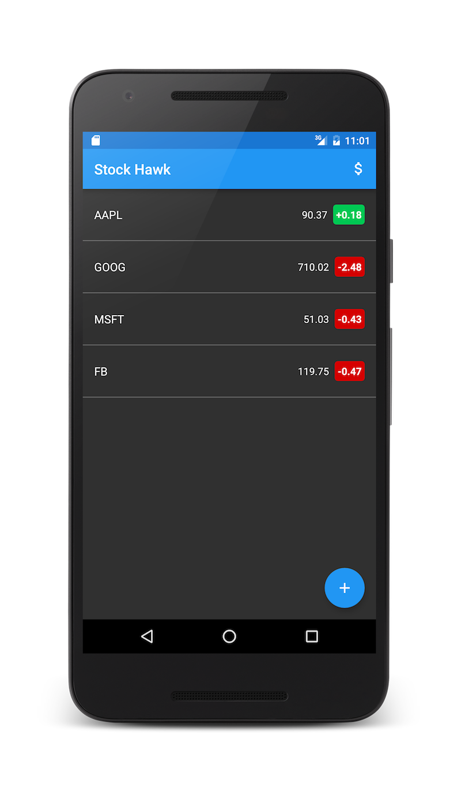
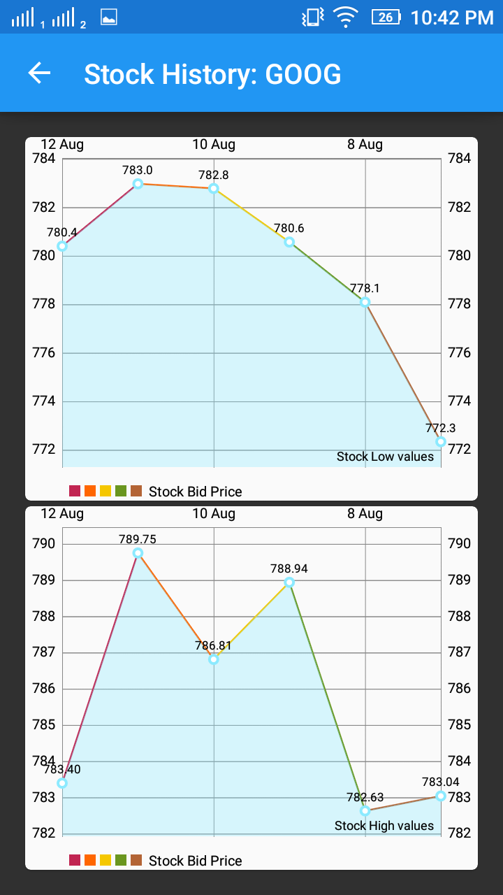

# StockHawk
An Android app for monitoring stocks. This will replace Project 3 in the Android Developer Nanodegree.

Screenshots
-----------

### List of Stocks

### History for Clicked Stock

## References
- Icon borrowed from : http://www.iconarchive.com/show/ios7-redesign-concept-icons-by-kentagon/ios7-stock-icon.html
- Couple of useful links : http://stackoverflow.com/a/38320290/3222727, http://stackoverflow.com/a/11554211/3222727, http://stackoverflow.com/a/2032105/3222727 and many more.
